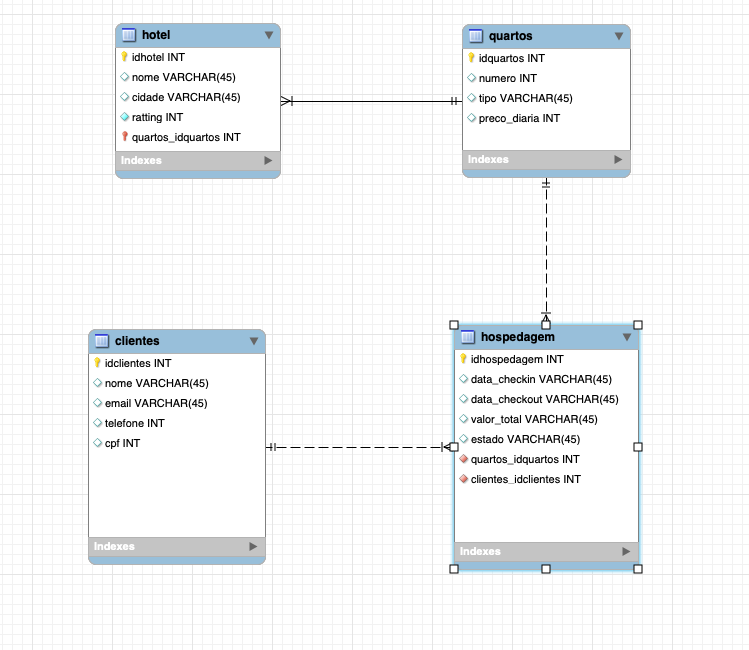

# mysqlhotel
Projeto prático desenvolvido em MySQL para Disciplina de Banco de Dados no CST em ciência de dados da UNIVALI.

Você foi contratado para criar um sistema de gerenciamento de hospedagens hoteleiras. O sistema deve ser capaz de armazenar informações sobre hotéis, quartos, clientes e hospedagens. Os clientes podem se hospedar em quartos de hotéis diferentes, e é importante manter um registro das reservas/hospedagens.

Informações a serem armazenadas:

Sobre o hotel: nome, nome do hotel; cidade, cidade onde o hotel está localizado; ratting, classificação do hotel em estrelas (de 1 até 5).
Sobre os quartos: número, número do quarto; tipo, tipo de quarto (podendo conter os valores "Standard", "Deluxe", "Suíte"); preco_diaria, preço da diária do quarto.
Sobre os clientes: nome, nome do cliente; email, endereço de e-mail do cliente; telefone, número de telefone do cliente; cpf, número de CPF do cliente.
Sobre as hospedagens: Tabela "Hospedagem": cliente, identificador do cliente que fez a reserva; quarto, identificador do quarto reservado; data_checkin, data de check-in da hospedagem; data_checkout, data de check-out da hospedagem; Valor_total, custo total da hospedagem, calculado quando a hospedagem é finalizada; estado, status da hospedagem, podendo receber os seguintes valores: “reserva”, reservado pelo cliente; “finalizada”, hospedagem “concluida”; “hospedado”, o cliente está atualmente hospedado no hotel; “cancelada”, a hospedagem (reserva) foi cancelada.
As regras de negócio definem que:

Um hotel possuí diversos quartos, e um quarto pertence a um hotel específico;
Uma hospedagem deve registrar um quarto e um cliente associados;
Um cliente pode efetuar diversas hospedagens, mesmo havendo hospedagens simultâneas;
Com base nas informações apresentadas anteriormente, realize as seguintes atividades:

Importante: Mantenha a ordem cronológica do código SQL gerado para a resolução da atividade. A atividade deverá ser desenvolvida utilizando o MYSQL Workbench. A correção se dará pela execução sequencial do código, erros nos itens 1 e 2, impedirão o prosseguimento da correção. Execute o seu código de forma sequencial antes de submetê-lo.

(0,5 ponto) Gerar o MER (Modelo entidade relacionamento) usando o MYSql Workbench (salvar somente a imagem, não sendo necessário código para este item).
(0,5 ponto) Crie o esquema de banco de dados para o sistema de gerenciamento de hospedagens hoteleiras nomeado “hospedar”.
(1,5 pontos) Crie as tabelas "Hotel", "Quarto", "Cliente" e "Hospedagem" com as informações especificadas no item “Informações a serem armazenadas”.
(1,5 pontos) Insira dados artificiais nas tabelas "Hotel" (5 hotéis), "Quarto"(5 para cada hotel), "Cliente"(5 clientes) e "Hospedagem" (25 hospedagens, 5 para cada um dos “Status”) para simular hotéis, quartos, clientes e hospedagens.
(6 pontos) Escreva as seguintes consultas SQL:
Listar todos os hotéis e seus respectivos quartos, apresentando os seguintes campos: para hotel, nome e cidade; para quarto, tipo e preco_diaria;
Listar todos os clientes que já realizaram hospedagens (status igual á “finalizada”), e os respectivos quartos e hotéis;
Mostrar o histórico de hospedagens em ordem cronológica de um determinado cliente;
Apresentar o cliente com maior número de hospedagens (não importando o tempo em que ficou hospedado);
Apresentar clientes que tiveram hospedagem “cancelada”, os respectivos quartos e hotéis.
Calcular a receita de todos os hotéis (hospedagem com Status igual a “finalizada”), ordenado de forma decrescente;
Listar todos os clientes que já fizeram uma reserva em um hotel específico;
Listar o quanto cada cliente que gastou em hospedagens (status igual a “finalizada”), em ordem decrescente por valor gasto.
Listar todos os quartos que ainda não receberam hóspedes.
Apresentar a média de preços de diárias em todos os hotéis, por tipos de quarto.
Deletar todos as hospedagens com status igual a “cancelada” (via código).
Criar a coluna checkin_realizado do tipo booleano na tabela Hospedagem (via código). E atribuir verdadeiro para as Hospedagens com status “finalizada” e “hospedado”, e como falso para Hospedagens com status “reserva” e “cancelada”.
Mudar o nome da coluna “ratting” da tabela Hotel para “classificacao” (via código).
Criar uma VIEW, para mostrar todas as reservas (hospedagem status “reserva”) a partir da data atual (você pode usar NOW()), apresentando os dados do Cliente, Quarto e Hotel, ordenadas por “data_checkin”.
Critérios de avaliação:

Correta confecção e utilização das instruções de definição e manipulação de dados;
Correto uso da linguagem SQL.

